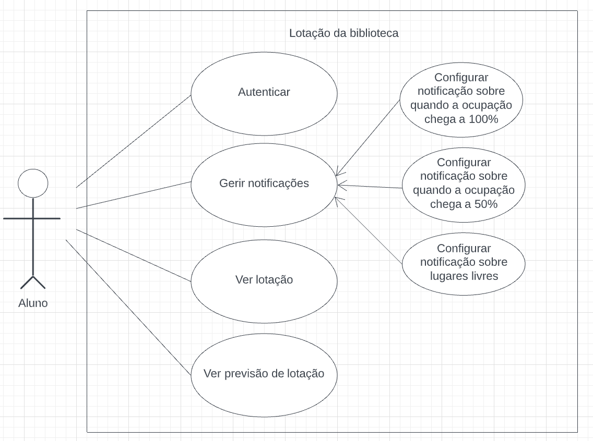
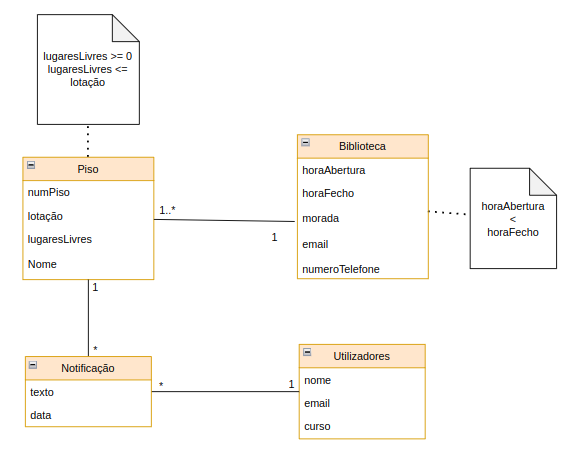
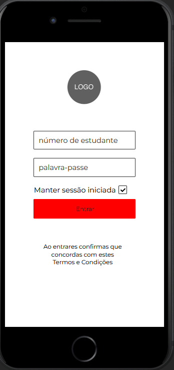
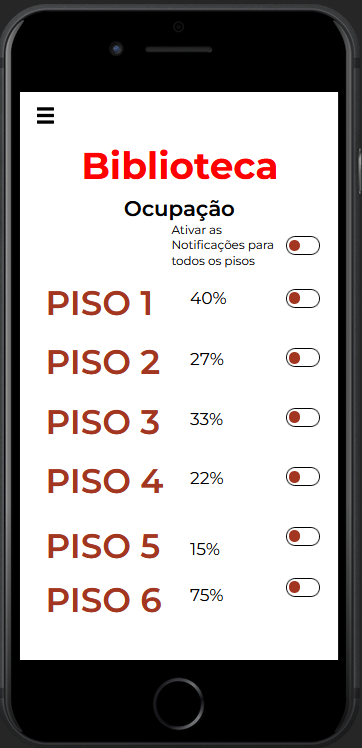
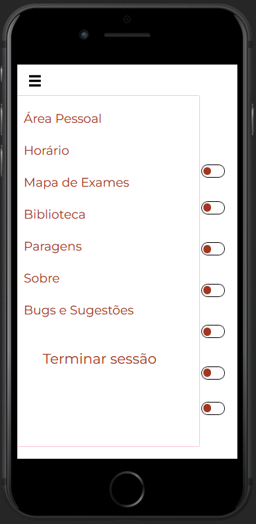
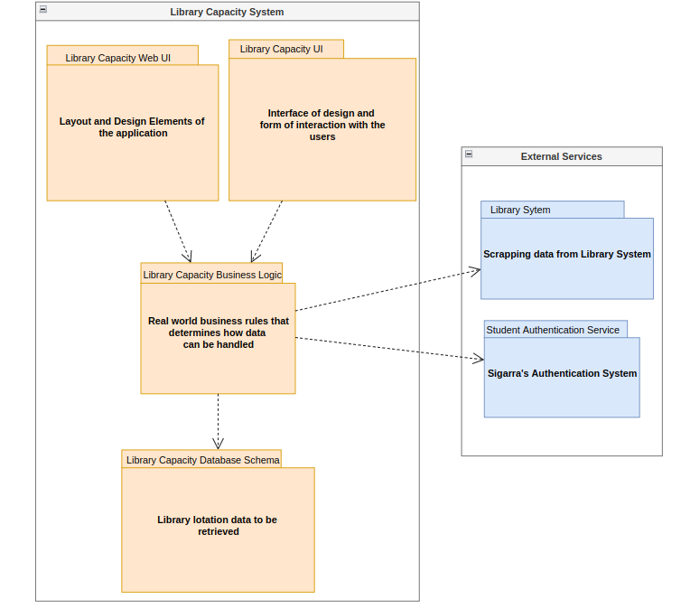
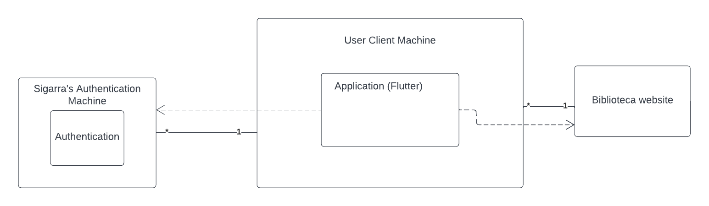

# Engenharia de Software
# Team Lotação

## Visão 

A primeira iteração deste produto é destinado a estudantes da FEUP que pretendam ter informação sobre a lotação da biblioteca em tempo real de forma simples e eficaz, sem necessidade de deslocação. Ao contrário do site da biblioteca, é possível consultar a qualquer hora de forma mais imediata a sua disponibilidade. A aplicação poderá notificar os utilizadores sobre quando a capacidade de cada piso está a baixo de 30% de e quando ultrapassa os 70% de capacidade. Além disso a aplicação prevê a disponibilidade da biblioteca no geral e nos seus pisos baseando-se na ocupação média habitual diária. Contudo em próximas iterações esta ideia pode ser aplicada a outras infraestruturas da faculdade. 

## Use case modeling

|                                  |                                                                                                                                                                                 |
|----------------------------------|---------------------------------------------------------------------------------------------------------------------------------------------------------------------------------|
| Name                             | Ver lotação da biblioteca.                                                                                                                                      |
| Actor                            | Aluno.                                                                                                                                  |
| Description                      | O aluno verifica a lotação da biblioteca, podendo ver a lotação de cada piso.                                                                                   |
| PreConditions                    | - O aluno está autenticado.                             |
| PostConditions                   | - O aluno consegue ver a lotação de todos os pisos da biblioteca |
| Normal Flow                      | 1.   O aluno abre a aplicação. 2. O aluno autentica-se. 3. A aplicação mostra a lotação de todos os pisos.                                                                                 |
| Alternative flows and exceptions | 1. [Falha de autenticação]  Se no passo 2 as credenciais de autenticação estiverem erradas a aplicação diz que os dados não estão corretos e pede para tentar outra vez.                                                                                           |

|                                  |                                                                                                                                                                                 |
|----------------------------------|---------------------------------------------------------------------------------------------------------------------------------------------------------------------------------|
| Name                             | Gerir Notificações.                                                                                                                                      |
| Actor                            | Aluno.                                                                                                                                  |
| Description                      | O aluno ativa ou desativa notificações com informação sobre a lotação de cada piso.                                                                                   |
| PreConditions                    | - O aluno está autenticado.                             |
| PostConditions                   | - O aluno pode receber notificações em relação aos lugares livres. |
| Normal Flow                      | 1.   O aluno abre a aplicação. 2. O aluno autentica-se. 3. A aplicação mostra a lotação de todos os pisos. 4. O aluno pode ativar ou desativar as notificações.                                                                                 |
| Alternative flows and exceptions | 1. [Falha de autenticação]  Se no passo 2 as credenciais de autenticação estiverem erradas a aplicação diz que os dados não estão corretos e pede para tentar outra vez.                                                                                           |

|                                  |                                                                                                                                                                                 |
|----------------------------------|---------------------------------------------------------------------------------------------------------------------------------------------------------------------------------|
| Name                             | Autenticar                                                                                                                                      |
| Actor                            | Aluno.                                                                                                                                  |
| Description                      | O aluno insere as credencias para se autenticar.                                                                                   |
| PreConditions                    | - Nenhuma                             |
| PostConditions                   | - O aluno consegue aceder a todas as funcinalidades da aplicação  |
| Normal Flow                      | 1.   O aluno abre a aplicação. 2. O aluno autentica-se.                                                                        |
| Alternative flows and exceptions | 1. [Falha de autenticação]  Se no passo 2 as credenciais de autenticação estiverem erradas a aplicação diz que os dados não estão corretos e pede para tentar outra vez.                                                                                           |

|                                  |                                                                                                                                                                                 |
|----------------------------------|---------------------------------------------------------------------------------------------------------------------------------------------------------------------------------|
| Name                             | Ver previsão da lotação da biblioteca.                                                                                                                                      |
| Actor                            | Aluno.                                                                                                                                  |
| Description                      | O aluno verifica a previsão da lotação da biblioteca, podendo ver a previsão de cada piso.                                                                                   |
| PreConditions                    | - O aluno está autenticado.                             |
| PostConditions                   | - O aluno consegue ver a previsão da lotação da biblioteca e de todos os seus pisos |
| Normal Flow                      | 1.   O aluno abre a aplicação. 2. O aluno autentica-se. 3. A aplicação mostra a previsão da lotação da biblioteca. 4. A aplicação mostra a previsão da lotação de cada piso.                                                                                 |
| Alternative flows and exceptions | 1. [Falha de autenticação]  Se no passo 2 as credenciais de autenticação estiverem erradas a aplicação diz que os dados não estão corretos e pede para tentar outra vez.                                                                                           |

## Domain Model

## UI mockups

## Architecture and Design
Our application will be developed in flutter, we will be scraping data from a website to get the ocupation of each floor of the library to display it more readble and accessible. In regards of the authentication we will be using Sigarras's login service.

### Logical Architecture

### Physical Architecture

